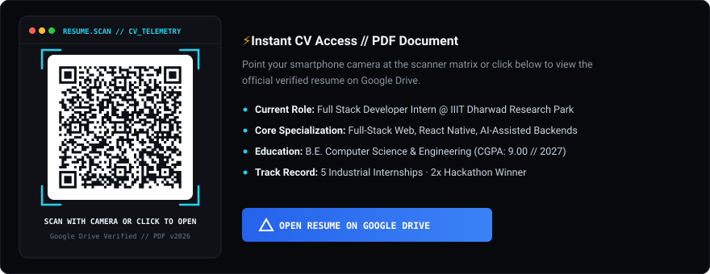

<!-- =========================================================================
     DEVELOPER OPERATING SYSTEM :: ONKAR BEVINAKATTI [term://onkar.os]
     Dark/Light Theme Aware | Vector Engineered | Production-Grade README
     ========================================================================= -->

<div align="center">

<!-- HERO CONTAINER (THEME-AWARE SVG BANNER) -->
<picture>
  <source media="(prefers-color-scheme: dark)" srcset="assets/dark.svg" />
  <source media="(prefers-color-scheme: light)" srcset="assets/light.svg" />
  
</picture>

</div>

<br/>

<!-- ==================== SECTION 1: IDENTITY & STATS BAR ==================== -->

### `// 01. SYSTEM IDENTITY & METRICS`

```
┌── ENGINEERING // PHILOSOPHY // ARCHITECTURE ─────────────────────────────────┐
│ Full-Stack & Blockchain Engineer specializing in high-throughput distributed  │
│ systems, decentralized application protocols, and high-performance web apps. │
│ Focused on deterministic state machines, vector interfaces, and clean code.  │
└──────────────────────────────────────────────────────────────────────────────┘
```

<table width="100%">
  <tr align="center">
    <td width="25%">
      <h3>1.5+ Years</h3>
      <sub>INTERNSHIP EXPERIENCE</sub>
    </td>
    <td width="25%">
      <h3>80+</h3>
      <sub>PROJECTS BUILT</sub>
    </td>
    <td width="25%">
      <h3>10+</h3>
      <sub>HACKATHONS PARTICIPATED</sub>
    </td>
    <td width="25%">
      <h3>5</h3>
      <sub>INDUSTRY INTERNSHIPS</sub>
    </td>
  </tr>
</table>

<br/>

<!-- ==================== SECTION 2: CURRENTLY BUILDING ==================== -->

### `// 02. CURRENT RUNTIME ($ current.focus)`

```zsh
$ onkar.os --status --verbose

❯ CURRENTLY_BUILDING : High-throughput DApps, Full-Stack SaaS & AI Automation Platforms
❯ ARCHITECTURE_FOCUS : Multi-Tenant ERP Systems & Autonomous AI Agent Pipelines
❯ EXPLORING          : Zero-Knowledge Proofs, Account Abstraction & Groq AI Voice Workflows
❯ SHIPPING           : Production Mobile PWAs, EVM Contracts & Real-Time Dashboards
```

<br/>

<!-- ==================== SECTION 3: TECH STACK ==================== -->

### `// 03. TECHNICAL ARSENAL`

<table>
  <tr>
    <td width="20%" align="right"><b>Core Languages</b></td>
    <td>
      
      
      
      
      
      
    </td>
  </tr>
  <tr>
    <td width="20%" align="right"><b>Frontend & Mobile</b></td>
    <td>
      
      
      
      
      
      
      
    </td>
  </tr>
  <tr>
    <td width="20%" align="right"><b>Backend & Web3</b></td>
    <td>
      
      
      
      
      
      
      
    </td>
  </tr>
  <tr>
    <td width="20%" align="right"><b>Database & Cache</b></td>
    <td>
      
      
      
      
      
    </td>
  </tr>
  <tr>
    <td width="20%" align="right"><b>Infra & Cloud</b></td>
    <td>
      
      
      
      
      
    </td>
  </tr>
</table>

<br/>

<!-- ==================== SECTION 4: FEATURED PROJECTS ==================== -->

### `// 04. SELECTED ARTIFACTS & PRODUCTION WORK`

<table width="100%">
  <tr>
    <td width="50%" valign="top">
      <h4>🚀 ApplyBot &nbsp; </h4>
      <p><b>Productivity & AI Tool</b> &nbsp;·&nbsp; <code>Feb 2026</code></p>
      <p><i>AI-Powered Cold Email Outreach Automation Platform</i></p>
      <ul>
        <li>AI-powered cold email automation platform with bulk & manual outreach, integrating <b>Groq AI</b> and RESTful APIs to deliver role-specific emails.</li>
        <li>Parses candidate resumes, GitHub, LinkedIn, and portfolios for hyper-personalized outreach.</li>
        <li>Proven real-world efficacy, securing internships for multiple active users.</li>
      </ul>
      <p><code>MongoDB</code> · <code>Express</code> · <code>React</code> · <code>Node.js</code> · <code>Groq AI</code> · <code>REST APIs</code> · <code>TailwindCSS</code></p>
      <p>
        <a href="https://github.com/prembevinakatti"><b>[ GitHub Repo ]</b></a>
        &nbsp;&nbsp;
        <a href="https://onkarportfolio.onrender.com/"><b>[ Live Demo ↗ ]</b></a>
      </p>
    </td>
    <td width="50%" valign="top">
      <h4>🏢 ERPGO &nbsp; </h4>
      <p><b>Enterprise Full Stack System</b> &nbsp;·&nbsp; <code>Jan 2026</code></p>
      <p><i>Multi-Tenant Enterprise Resource Planning Platform</i></p>
      <ul>
        <li>16 integrated modules spanning Academics, Finance, HR, Payroll, Recruitment, Accounting, Procurement, Inventory, Transport, and Hostel.</li>
        <li>Enterprise-grade security with <b>JWT authentication</b>, granular <b>RBAC</b>, and complete multi-tenant database isolation.</li>
        <li>Comprehensive audit logging, automated workflow triggers, and input validation.</li>
      </ul>
      <p><code>MongoDB</code> · <code>Express</code> · <code>React</code> · <code>Node.js</code> · <code>JWT</code> · <code>RBAC</code> · <code>REST APIs</code> · <code>TailwindCSS</code></p>
      <p>
        <a href="https://github.com/prembevinakatti"><b>[ GitHub Repo ]</b></a>
        &nbsp;&nbsp;
        <a href="https://onkarportfolio.onrender.com/"><b>[ Architecture Spec ↗ ]</b></a>
      </p>
    </td>
  </tr>
  <tr>
    <td width="50%" valign="top">
      <h4>🏆 JanSetu &nbsp; </h4>
      <p><b>Civic Tech & Blockchain</b> &nbsp;·&nbsp; <code>March 2025 · BEC Bagalkot</code></p>
      <p><i>Intelligent Civic Complaint Management & AI Calling Agent</i></p>
      <ul>
        <li>Decentralized civic issue reporting platform with <b>NLP classification</b> and automated severity triage in Python FastAPI.</li>
        <li>Tamper-proof status updates recorded on <b>Polygon blockchain & IPFS</b> for verifiable audit trails.</li>
        <li>Citizen reporting via WhatsApp bot and autonomous <b>AI voice calling agents</b>.</li>
      </ul>
      <p><code>MERN Stack</code> · <code>Polygon</code> · <code>Solidity</code> · <code>IPFS</code> · <code>Python FastAPI</code> · <code>NLP</code> · <code>Voice AI</code></p>
      <p>
        <a href="https://github.com/prembevinakatti"><b>[ GitHub Repo ]</b></a>
        &nbsp;&nbsp;
        <a href="https://onkarportfolio.onrender.com/"><b>[ Project Demo ↗ ]</b></a>
      </p>
    </td>
    <td width="50%" valign="top">
      <h4>⚡ DoitNow &nbsp; </h4>
      <p><b>Productivity PWA</b> &nbsp;·&nbsp; <code>2025</code></p>
      <p><i>Neo-Brutalist PWA Task Management Platform</i></p>
      <ul>
        <li>Daily task management Progressive Web App built with a bold <b>neo-brutalist UI</b> design system and high-contrast layout.</li>
        <li>Installable <b>PWA</b> with responsive mobile-first architecture and offline caching.</li>
        <li><b>Firebase</b> real-time push notifications for active task and deadline synchronization.</li>
      </ul>
      <p><code>React</code> · <code>Node.js</code> · <code>Express</code> · <code>MongoDB</code> · <code>PWA</code> · <code>Firebase</code> · <code>TailwindCSS</code></p>
      <p>
        <a href="https://github.com/prembevinakatti"><b>[ GitHub Repo ]</b></a>
        &nbsp;&nbsp;
        <a href="https://onkarportfolio.onrender.com/"><b>[ Live App ↗ ]</b></a>
      </p>
    </td>
  </tr>
</table>

<br/>

<!-- ==================== SECTION 5: INTERNSHIPS & EXPERIENCE ==================== -->

### `💼 EXPERIENCE // 5_INDUSTRIAL_INTERNSHIPS`

<details open>
<summary><b>🏢 01 / Full Stack Developer Intern — IIIT Dharwad Research Park</b> &nbsp; <code>July 2025 – Present</code></summary>
<br/>

📍 **Location:** Dharwad, Karnataka, India *(Hybrid)* &nbsp;|&nbsp; 🏷️ **Domain:** Sleep-Pod Booking Platform & Cloud Infrastructure

<p>
  
  
  
  
  
  
  
  
</p>

* ⚡ **Full-Stack Architecture:** Developed complete frontend and backend for a production-ready sleep-pod booking platform with responsive UI, user/booking modules, admin operations, and scalable RESTful APIs.
* ⚡ **Cloud & Payments:** Integrated Razorpay for secure payments and AWS services for deployment/data handling, ensuring reliable backend services and seamless end-to-end application integration.

</details>

<br/>

<details open>
<summary><b>🏢 02 / Full Stack Web Developer — LettrBlack</b> &nbsp; <code>Sept 2025 – Feb 2026</code></summary>
<br/>

📍 **Location:** Bengaluru, India *(Remote)* &nbsp;|&nbsp; 🏷️ **Domain:** Scalable Full-Stack Web Applications & Role-Based Systems

<p>
  
  
  
  
  
  
  
</p>

* ⚡ **MERN Architecture:** Developed and maintained scalable full-stack web applications using the MERN stack with optimized MongoDB schema architecture.
* ⚡ **Security & Performance:** Implemented authentication systems, role-based access control (RBAC), and optimized backend logic for enhanced query performance.

</details>

<br/>

<details open>
<summary><b>🏢 03 / Software Developer Intern — VoyagerAI</b> &nbsp; <code>March 2025 – Sept 2025</code></summary>
<br/>

📍 **Location:** Remote &nbsp;|&nbsp; 🏷️ **Domain:** AI-Driven Search Optimization & International Client Solutions

<p>
  
  
  
  
  
  
  
  
</p>

* ⚡ **Debounced Search Engine:** Implemented a mobile-first, debounced search feature with optimized query handling, cutting navigation/search latency by 30%.
* ⚡ **Production Deployments:** Shipped user-facing features end-to-end (frontend to API) into production for international client projects, elevating session retention.

</details>

<br/>

<details open>
<summary><b>🏢 04 / React Native Developer Intern — ARMB</b> &nbsp; <code>March 2025 – Sept 2025</code></summary>
<br/>

📍 **Location:** Remote &nbsp;|&nbsp; 🏷️ **Domain:** On-Demand Mobile Home Services Ecosystem

<p>
  
  
  
  
  
  
</p>

* ⚡ **Mobile Architecture:** Engineered core frontend features for an on-demand home services mobile application connecting users with technicians and service providers.
* ⚡ **Dispatch & Interface:** Architected the service provider module interface, implementing real-time booking requests, live job tracking, and fluid native user flows.

</details>

<br/>

<details open>
<summary><b>🏢 05 / Full Stack Web Developer Intern — QuantumHarbour Technologies</b> &nbsp; <code>Sept 2025 – Dec 2025</code></summary>
<br/>

📍 **Location:** New Delhi, India *(Remote)* &nbsp;|&nbsp; 🏷️ **Domain:** 3D Interactive Web Platforms & Facility Booking Engines

<p>
  
  
  
  
  
  
</p>

* ⚡ **3D Web Architecture:** Built immersive 3D interactive web experiences using Spline, Framer Motion, and React.js with optimized sub-second load times.
* ⚡ **Booking System:** Developed a Ground Booking Web Application with automated schedule management, booking flows, and code quality enhancements.

</details>

<br/>

<!-- ==================== SECTION 6: ACHIEVEMENTS & HACKATHONS ==================== -->

### `🏆 // 06. ACHIEVEMENTS & HACKATHON RECORDS`

```yaml
hackathon_victories:
  - event: "HackToFuture (Belagavi)"
    result: "WINNER 🏆 (1st Place among 100+ competing engineering teams)"
  
  - event: "CodeFiesta 5.0 (Gadag)"
    result: "WINNER 🏆 (1st Place among 100+ competing engineering teams)"
  
  - event: "National Level Hackathons"
    result: "Top 10 Finalist across 800+ teams (Achieved 3x times) & Top 25 in 6+ hackathons"

industrial_milestone:
  - summary: "5 Successful Industrial Engineering Internships completed prior to graduation"
  - domains: "Full-Stack Development, AI-Assisted Backend Services, Multi-Tenant Cloud Architecture"
```

<br/>

<!-- ==================== SECTION 7: RESUME HUD SCANNER ==================== -->

### `📄 // 07. CREDENTIALS // RESUME_SCANNER`

<div align="center">

<a href="https://drive.google.com/file/d/1tNLVWYCM9jyN3SjJYti5hJNV8vS5z_zY/view?usp=drivesdk" target="_blank">
  
</a>

</div>

<br/>

<!-- ==================== SECTION 8: GITHUB ACTIVITY / STATS ==================== -->

### `// 08. TELEMETRY & OBSERVABILITY`

<div align="center">

<!-- Full-Width Contribution Streak -->


<br/><br/>

<!-- GitHub Stats & Top Languages (Side by Side) -->
<table border="0" width="100%">
  <tr>
    <td width="50%" align="center">
      
    </td>
    <td width="50%" align="center">
      
    </td>
  </tr>
</table>

</div>

<br/>

<!-- ==================== SECTION 9: CONTRIBUTION SNAKE ==================== -->

### `// 09. CONTRIBUTION STREAM`

<div align="center">

<picture>
  <source media="(prefers-color-scheme: dark)" srcset="https://raw.githubusercontent.com/prembevinakatti/prembevinakatti/output/github-snake-dark.svg" />
  <source media="(prefers-color-scheme: light)" srcset="https://raw.githubusercontent.com/prembevinakatti/prembevinakatti/output/github-snake.svg" />
  
</picture>

</div>

<br/>

<!-- ==================== SECTION 10: SOCIAL / CONTACT ==================== -->

### `// 10. NETWORK UPLINK & CHANNELS`

<div align="center">

<a href="https://linkedin.com/in/onkar-bevinakatti-6515b8292" target="_blank">
  
</a>
&nbsp;
<a href="mailto:onkarbevinakatti09@gmail.com">
  
</a>
&nbsp;
<a href="https://onkarportfolio.onrender.com/" target="_blank">
  
</a>
&nbsp;
<a href="https://drive.google.com/file/d/1tNLVWYCM9jyN3SjJYti5hJNV8vS5z_zY/view?usp=drivesdk" target="_blank">
  
</a>

<br/><br/>

<sub>SYSTEM INTEGRITY: 100% · COMPILED WITH PRECISION · © 2026 ONKAR BEVINAKATTI</sub>

</div>
